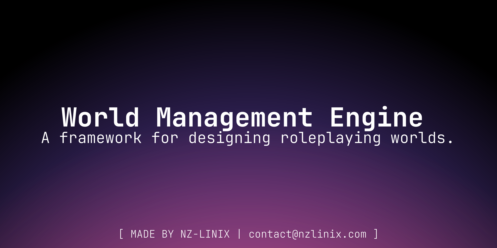

<h1 align="center">World Management Engine</h1>

    
    
    
     

<h2 align="center">What is WME?</h2>

The WME (World Management Engine) is a framework that acts as your backend for anything AI roleplay related. It lets you create chats with custom characters, user personas, worlds with lore and many more things.
